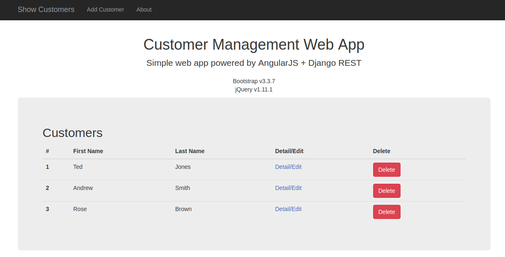
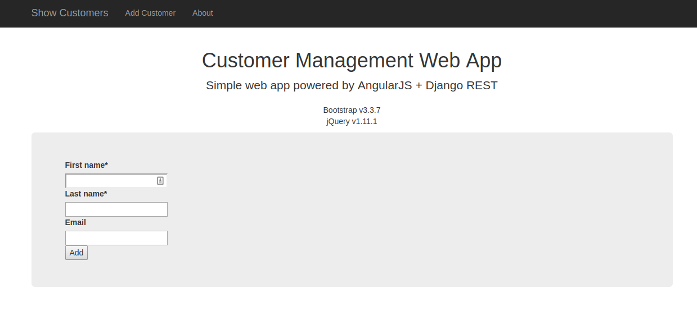

# customerManagementApp

### Description
##### Example of angularJS with Django REST API
Application allows you to add new customers to the database, update their personal information, delete customer, view all the customers in a list or view details of the specific customer.

### Quickstart
```
pip install -r requirements.txt
```
```
python manage.py migrate
```
```
python manage.py runserver
```

### Preview

#### Customers Page - Detail, Edit, Delete

#### Add Customer

#### About Page


Python 3.5+

Requirements may be outdated and with old version modules.
